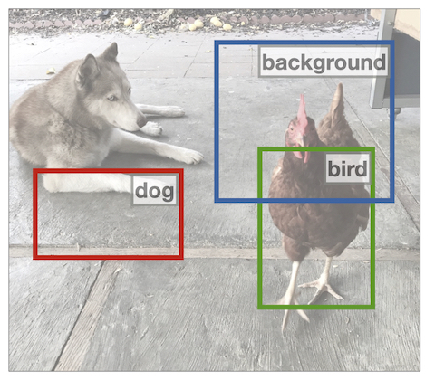
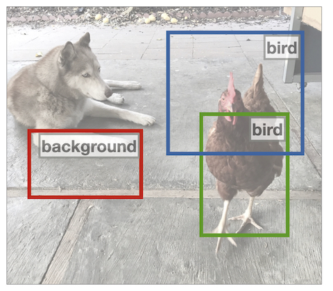

# Detection Transformers with Assignment

By [Jeffrey Ouyang-Zhang](https://jozhang97.github.io/),  [Jang Hyun Cho](https://sites.google.com/view/janghyuncho/), [Xingyi Zhou](https://www.cs.utexas.edu/~zhouxy/), [Philipp Krähenbühl](http://www.philkr.net/)

This repository is an official implementation of the paper [NMS Strikes Back](https://arxiv.org/abs/2212.06137).


**TL; DR.** **De**tection **T**ransformers with **A**ssignment (DETA) re-introduce IoU assignment and NMS for transformer-based detectors. DETA trains and tests comparibly as fast as Deformable-DETR and converges much faster (50.2 mAP in 12 epochs on COCO).

DETR's one-to-one bipartite matching |  Our many-to-one IoU-based assignment
:-------------------------:|:-------------------------:
  |  

## Main Results

| Method | Epochs | COCO <br/> val AP   | Total Train time <br/> (8 GPU hours) | Batch Infer <br/>Speed (FPS) | URL                                                                                                                                                                                                                                     |
|---------------------------|:--------:|:------:|:------------------------------------:|:------------------------------:|-----------------------------------------------------------------------------------------------------------------------------------------------------------------------------------------------------------------------------------------|
| Two-stage Deformable DETR | 50     | 46.9 |      42.5                                | -                            | see <br/> [DeformDETR](https://github.com/fundamentalvision/Deformable-DETR)                                                                                                                                                                  |
| Improved Deformable DETR    | 50     | 49.6 |      66.6                                | 13.4                         | [config](./configs/improved_baseline.sh)<br/>[log](https://drive.google.com/file/d/1dzOOUogaBFQu-zuXCMxcOq3KT-JqakwE/view?usp=sharing) <br/>[model](https://drive.google.com/file/d/1Xa-KPL68fx3kura6W6l8D55walXCa62m/view?usp=sharing) |
| DETA                      | 12     | 50.1 |      16.3                                | 12.7                         | [config](./configs/deta.sh)<br/>[log](https://drive.google.com/file/d/1walR0h_M9yDqaUfIRHr_O6CAjaRFRKyq/view?usp=sharing) <br/>[model](https://drive.google.com/file/d/1fBQX6GAv_7OvNJaHaebwXAYrgktzeTUQ/view?usp=sharing)              |
| DETA                      | 24     | 51.1 |     32.5                                | 12.7                         | [config](./configs/deta_2x.sh)<br/>[log](https://drive.google.com/file/d/14aDFO52HHLbQhXhVFHb0-KV8j_XD9w49/view?usp=sharing) <br/>[model](https://drive.google.com/file/d/1XDVXNIDyUFybWvMI8diWuo-gu_7saArO/view?usp=sharing)           |
| DETA (Swin-L)                | 24     | 62.9 |     100                                | 4.2                     | [config-O365](./configs/deta_swin_pre.sh)<br/>[model-O365](https://utexas.box.com/s/5jgu0nfzdcln4b6eknwz981q0kzgv36l) <br/> [config](./configs/deta_swin_ft.sh) <br/>[model](https://utexas.box.com/s/py0nnzl5fmx4bw3hx7p2ww038uyznjs0)           |

*Note:*

1. Unless otherwise specified, the model uses ResNet-50 backbone and training (ResNet-50) is done on 8 Nvidia Quadro RTX 6000 GPU.
2. Inference speed is measured on Nvidia Tesla V100 GPU.
3. "Batch Infer Speed" refer to inference with batch size = 4 to maximize GPU utilization.
4. Improved DeformableDETR implements two-stage Deformable DETR with improved hyperparameters (e.g. more queries, more feature levels, see full list [here](./configs/improved_baseline.sh)).
5. DETA with Swin-L backbone is pretrained on Object-365 and fine-tuned on COCO. This model attains 63.5AP on COCO test-dev. Times refer to fine-tuning (O365 pre-training takes 14000 GPU hours). We additionally provide the pre-trained Object365 config and model prior to fine-tuning.

## Installation

Please follow instructions from [Deformable-DETR](https://github.com/fundamentalvision/Deformable-DETR) for installation, data preparation, and additional usage examples.
Tested on torch1.8.0+cuda10.1 and torch1.6.0+cuda9.2 and torch1.11.0+cuda11.3

## Usage

### Evaluation

You can evaluate our pretrained DETA models from the above table on COCO 2017 validation set:

```bash
./configs/deta.sh --eval --coco_path ./data/coco --resume <path_to_model>
```

You can also run distributed evaluation:

```bash
GPUS_PER_NODE=8 ./tools/run_dist_launch.sh 8 ./configs/deta.sh \
    --eval --coco_path ./data/coco --resume <path_to_model>
```


You can also run distributed evaluation on our Swin-L model:

```bash
GPUS_PER_NODE=8 ./tools/run_dist_launch.sh 8 ./configs/deta_swin_ft.sh \
    --eval --coco_path ./data/coco --resume <path_to_model>
```

### Training

#### Training on single node

Training DETA on 8 GPUs:

```bash
GPUS_PER_NODE=8 ./tools/run_dist_launch.sh 8 ./configs/deta.sh --coco_path ./data/coco
```

#### Training on slurm cluster

If you are using slurm cluster, you can simply run the following command to train on 1 node with 8 GPUs:

```bash
GPUS_PER_NODE=8 ./tools/run_dist_slurm.sh <partition> deta 8 configs/deta.sh \
    --coco_path ./data/coco
```

Fine-tune DETA with Swin-L on 2 nodes of each with 8 GPUs:

```bash
GPUS_PER_NODE=8 ./tools/run_dist_slurm.sh <partition> deta 16 configs/deta_swin_ft.sh \
    --coco_path ./data/coco --finetune <path_to_o365_model>
```

## License

This project builds heavily off of [Deformable-DETR](https://github.com/fundamentalvision/Deformable-DETR) and [Detectron2](https://github.com/facebookresearch/detectron2/). Please refer to their original licenses for more details. If you are using Swin-L backbone, please see [Swin](https://github.com/microsoft/Swin-Transformer) original license.

## Citing DETA
If you find DETA useful in your research, please consider citing:

```bibtex
@article{ouyangzhang2022nms,
  title={NMS Strikes Back},
  author={Ouyang-Zhang, Jeffrey and Cho, Jang Hyun and Zhou, Xingyi and Kr{\"a}henb{\"u}hl, Philipp},
  journal={arXiv preprint arXiv:2212.06137},
  year={2022}
}
```
